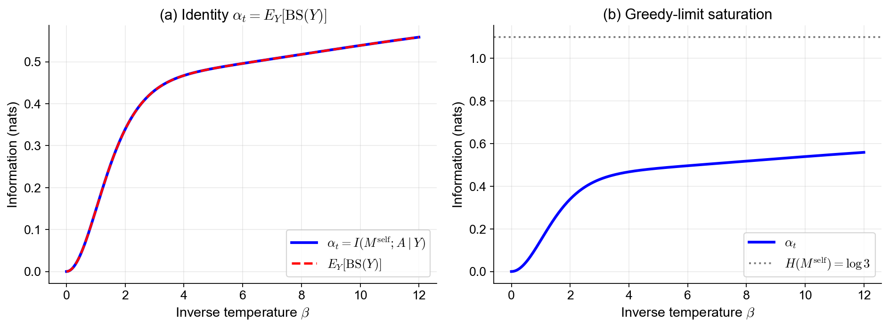
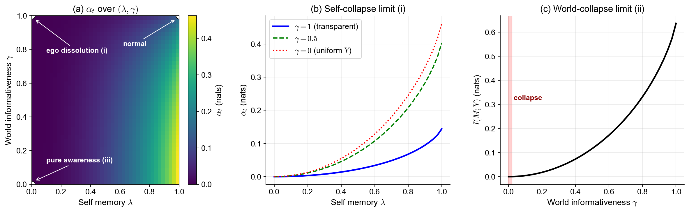
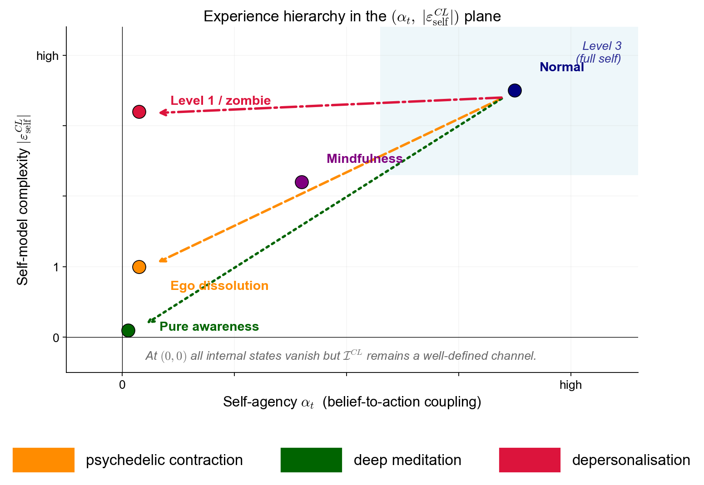
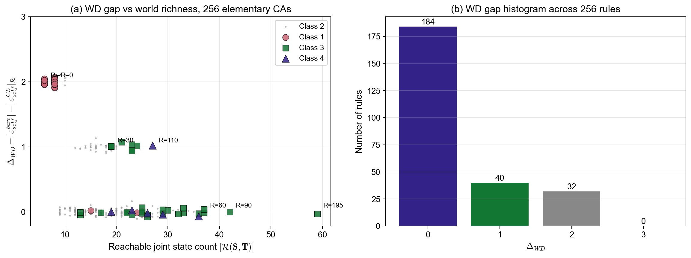

# self-model-numerics

Python toolkit for closed-loop self-models: predictive-equivalence quotients (KT, KT-CL), world-dependent opacity, and structural quantities ($\alpha_t$, $\sigma^{impl}$, $\eta$, $\Delta_{WD}$). Companion to Suzuki (2026).

## Paper

> Suzuki, K. (2026). *From World Models to Self-Models: Closed-Loop Computational Mechanics of Selfhood.* Draft.

LaTeX source, rigorous-proofs companion (FOUNDATIONS.md, STRESS_TEST_KT.md), and author review notes are at the manuscript repository: <https://github.com/ksk-S/self-model-closed-loop>.

## Figures at a glance

### `fig_alpha_efe.py` — α_t / belief-sensitivity identity

Numerical verification of Proposition `prop:alpha-bs` (the identity $\alpha_t = E_Y[\mathrm{BS}(Y)]$, universal in any policy kernel). The Boltzmann active-inference policy specialisation in Corollary `prop:alpha-efe` is verified across the temperature $\beta$ at machine precision (max residual $2.2 \times 10^{-16}$).



Used in §5.4 of the paper; reproduced as Figure 7 in §6.4.

### `fig_dissolution.py` — Dissolution limits

Limit transitions of Corollary `prop:dissolution` on the $(\lambda, \gamma)$ parameter plane: self-memory strength $\lambda \in [0, 1]$ on the horizontal axis, world informativeness $\gamma \in [0, 1]$ on the vertical. The three corners correspond to ego dissolution, pure awareness, and the normal mode.



Used in §5.4; reproduced as Figure 8 in §6.4.

### `fig_hierarchy.py` — Experience hierarchy

Schematic placement of phenomenological states (normal / depersonalisation / ego dissolution / pure awareness) on the $(\alpha_t, |\varepsilon^{CL}_{self}|)$ plane.



Used in §7.2 of the paper.

### `fig_ca_wd.py` — Theorem WD across the 256 ECAs

Cross-domain verification of Theorem WD on a single fixed Mealy-memory agent coupled in turn to each of the 256 elementary cellular automata: WD gap $\Delta_{WD}$ vs reachable joint-state count $|\mathcal{R}|$ (left), and the histogram of $\Delta_{WD}$ over the 256 rules (right). Wolfram-class membership is indicated by the marker.



Used as the central numerical evidence for Example C (256 ECA scan) in §6.3.

## Reproducing the figures

```bash
python -m venv venv
source venv/bin/activate          # macOS/Linux
# venv\Scripts\activate            # Windows
pip install -r requirements.txt

python fig_alpha_efe.py
python fig_dissolution.py
python fig_hierarchy.py
python fig_ca_wd.py
```

Each script is self-contained. Outputs are written to `figures/fig_*.pdf` (paper-ready) and `figures/fig_*.png` (preview); the path is computed relative to the script, so the scripts work regardless of the current working directory.

## Dependencies

- Python 3.9+
- NumPy
- Matplotlib

See [`requirements.txt`](requirements.txt).

## Roadmap (planned)

The paper proposes three distinctively testable predictions (Suzuki 2026, §7.4); reference implementations are planned here:

- **P1: Self-minimisation phase transition** — coupled $\varepsilon$-machine simulations showing $|\varepsilon^{CL}_{self}|$ contraction with critical scaling $\eta_c \sim \log|\mathcal{S}|/|\mathcal{R}|$ as $\eta = 1 - d_{CL}/d_{OL}$ is varied.
- **P2: Architecture convergence under transparent worlds** — opacity-graded T-maze variants comparing action-aware vs action-unaware agents as $\Omega_t \to 0$, extending Torresan et al. (2025) quantitatively.
- **P3: Structural marker for deceptive alignment** — $\Delta = |\mathcal{T}| - |\varepsilon^{CL}_{self}|$ measurement on sleeper-agent benchmarks (Hubinger et al. 2019).

A general-purpose minimum-state estimation utility (Givan-Dean-Greig partition refinement applied to closed-loop $\varepsilon$-transducers; see Appendix I.4 of the paper) is also planned.

## Citation

```bibtex
@unpublished{suzuki2026selfhood,
  author = {Suzuki, Keisuke},
  title  = {From World Models to Self-Models: Closed-Loop Computational Mechanics of Selfhood},
  year   = {2026},
  note   = {Draft}
}
```

## Author

Keisuke Suzuki — Center for Human Nature, Artificial Intelligence, and Neuroscience (CHAIN), Hokkaido University.
Contact: ksk@chain.hokudai.ac.jp

## License

TBD (will be set before paper submission).
